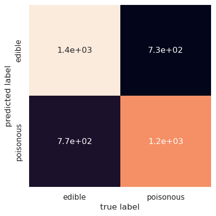
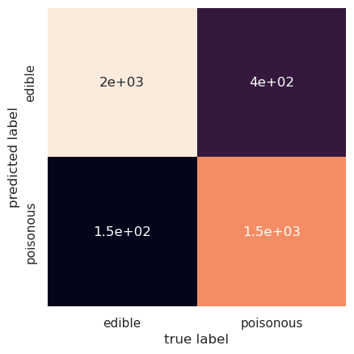

Title: mushroom edibility prediction with a vector support classifier 
Date: 2022-12-18 
Category: machine learning 
Tags: vector support machines 
Slug: mushroom edibility prediction with a vector support classifier
Authors: Kayla Lewis 
Summary: a vector support classifier can help identify whether a mushroom is edible (but beware!)


Suppose we'd like to make a vector support classifier to help us decide whether a mushroom might be edible. Disclaimer: I personally don't eat mushrooms that I find in the forest and, if I did, I definitely wouldn't use a machine learning algorithm alone to decide which ones to eat!! Now that's out of the way, let's see how well we can do.

After extracting the data, we have a look at it:


```python
import pandas as pd
mushrooms = pd.read_csv('mushrooms.csv')
mushrooms.head()
```
<table border="1" class="dataframe">
  <thead>
    <tr style="text-align: right;">
      <th></th>
      <th>class</th>
      <th>cap-shape</th>
      <th>cap-surface</th>
      <th>cap-color</th>
      <th>bruises</th>
      <th>odor</th>
      <th>gill-attachment</th>
      <th>gill-spacing</th>
      <th>gill-size</th>
      <th>gill-color</th>
      <th>...</th>
      <th>stalk-surface-below-ring</th>
      <th>stalk-color-above-ring</th>
      <th>stalk-color-below-ring</th>
      <th>veil-type</th>
      <th>veil-color</th>
      <th>ring-number</th>
      <th>ring-type</th>
      <th>spore-print-color</th>
      <th>population</th>
      <th>habitat</th>
    </tr>
  </thead>
  <tbody>
    <tr>
      <th>0</th>
      <td>p</td>
      <td>x</td>
      <td>s</td>
      <td>n</td>
      <td>t</td>
      <td>p</td>
      <td>f</td>
      <td>c</td>
      <td>n</td>
      <td>k</td>
      <td>...</td>
      <td>s</td>
      <td>w</td>
      <td>w</td>
      <td>p</td>
      <td>w</td>
      <td>o</td>
      <td>p</td>
      <td>k</td>
      <td>s</td>
      <td>u</td>
    </tr>
    <tr>
      <th>1</th>
      <td>e</td>
      <td>x</td>
      <td>s</td>
      <td>y</td>
      <td>t</td>
      <td>a</td>
      <td>f</td>
      <td>c</td>
      <td>b</td>
      <td>k</td>
      <td>...</td>
      <td>s</td>
      <td>w</td>
      <td>w</td>
      <td>p</td>
      <td>w</td>
      <td>o</td>
      <td>p</td>
      <td>n</td>
      <td>n</td>
      <td>g</td>
    </tr>
    <tr>
      <th>2</th>
      <td>e</td>
      <td>b</td>
      <td>s</td>
      <td>w</td>
      <td>t</td>
      <td>l</td>
      <td>f</td>
      <td>c</td>
      <td>b</td>
      <td>n</td>
      <td>...</td>
      <td>s</td>
      <td>w</td>
      <td>w</td>
      <td>p</td>
      <td>w</td>
      <td>o</td>
      <td>p</td>
      <td>n</td>
      <td>n</td>
      <td>m</td>
    </tr>
    <tr>
      <th>3</th>
      <td>p</td>
      <td>x</td>
      <td>y</td>
      <td>w</td>
      <td>t</td>
      <td>p</td>
      <td>f</td>
      <td>c</td>
      <td>n</td>
      <td>n</td>
      <td>...</td>
      <td>s</td>
      <td>w</td>
      <td>w</td>
      <td>p</td>
      <td>w</td>
      <td>o</td>
      <td>p</td>
      <td>k</td>
      <td>s</td>
      <td>u</td>
    </tr>
    <tr>
      <th>4</th>
      <td>e</td>
      <td>x</td>
      <td>s</td>
      <td>g</td>
      <td>f</td>
      <td>n</td>
      <td>f</td>
      <td>w</td>
      <td>b</td>
      <td>k</td>
      <td>...</td>
      <td>s</td>
      <td>w</td>
      <td>w</td>
      <td>p</td>
      <td>w</td>
      <td>o</td>
      <td>e</td>
      <td>n</td>
      <td>a</td>
      <td>g</td>
    </tr>
  </tbody>
</table>
<p>5 rows × 23 columns</p>
</div>

The "class" field represents "poisonous" with a "p" and "edible" with "e"; the other fields encode other mushroom properties similarly. We'll need to convert these letters into numerical data; for that we'll use the python command "ord":


```python
for n in range(0,mushrooms.shape[1]): 
    mushrooms.iloc[:,n] = [ord(x) - 97
                           for x in mushrooms[mushrooms.columns[n]]]
```


```python
mushrooms.head()
```

<table border="1" class="dataframe">
  <thead>
    <tr style="text-align: right;">
      <th></th>
      <th>class</th>
      <th>cap-shape</th>
      <th>cap-surface</th>
      <th>cap-color</th>
      <th>bruises</th>
      <th>odor</th>
      <th>gill-attachment</th>
      <th>gill-spacing</th>
      <th>gill-size</th>
      <th>gill-color</th>
      <th>...</th>
      <th>stalk-surface-below-ring</th>
      <th>stalk-color-above-ring</th>
      <th>stalk-color-below-ring</th>
      <th>veil-type</th>
      <th>veil-color</th>
      <th>ring-number</th>
      <th>ring-type</th>
      <th>spore-print-color</th>
      <th>population</th>
      <th>habitat</th>
    </tr>
  </thead>
  <tbody>
    <tr>
      <th>0</th>
      <td>15</td>
      <td>23</td>
      <td>18</td>
      <td>13</td>
      <td>19</td>
      <td>15</td>
      <td>5</td>
      <td>2</td>
      <td>13</td>
      <td>10</td>
      <td>...</td>
      <td>18</td>
      <td>22</td>
      <td>22</td>
      <td>15</td>
      <td>22</td>
      <td>14</td>
      <td>15</td>
      <td>10</td>
      <td>18</td>
      <td>20</td>
    </tr>
    <tr>
      <th>1</th>
      <td>4</td>
      <td>23</td>
      <td>18</td>
      <td>24</td>
      <td>19</td>
      <td>0</td>
      <td>5</td>
      <td>2</td>
      <td>1</td>
      <td>10</td>
      <td>...</td>
      <td>18</td>
      <td>22</td>
      <td>22</td>
      <td>15</td>
      <td>22</td>
      <td>14</td>
      <td>15</td>
      <td>13</td>
      <td>13</td>
      <td>6</td>
    </tr>
    <tr>
      <th>2</th>
      <td>4</td>
      <td>1</td>
      <td>18</td>
      <td>22</td>
      <td>19</td>
      <td>11</td>
      <td>5</td>
      <td>2</td>
      <td>1</td>
      <td>13</td>
      <td>...</td>
      <td>18</td>
      <td>22</td>
      <td>22</td>
      <td>15</td>
      <td>22</td>
      <td>14</td>
      <td>15</td>
      <td>13</td>
      <td>13</td>
      <td>12</td>
    </tr>
    <tr>
      <th>3</th>
      <td>15</td>
      <td>23</td>
      <td>24</td>
      <td>22</td>
      <td>19</td>
      <td>15</td>
      <td>5</td>
      <td>2</td>
      <td>13</td>
      <td>13</td>
      <td>...</td>
      <td>18</td>
      <td>22</td>
      <td>22</td>
      <td>15</td>
      <td>22</td>
      <td>14</td>
      <td>15</td>
      <td>10</td>
      <td>18</td>
      <td>20</td>
    </tr>
    <tr>
      <th>4</th>
      <td>4</td>
      <td>23</td>
      <td>18</td>
      <td>6</td>
      <td>5</td>
      <td>13</td>
      <td>5</td>
      <td>22</td>
      <td>1</td>
      <td>10</td>
      <td>...</td>
      <td>18</td>
      <td>22</td>
      <td>22</td>
      <td>15</td>
      <td>22</td>
      <td>14</td>
      <td>4</td>
      <td>13</td>
      <td>0</td>
      <td>6</td>
    </tr>
  </tbody>
</table>
<p>5 rows × 23 columns</p>
</div>


Ideally we wouldn't want to have to input all of these fields to classify a mushroom, so let's see what happens if we try to classify based only on, say, cap-shape and cap-surface. 


```python
from sklearn.svm import SVC
from sklearn.model_selection import train_test_split
from sklearn.metrics import accuracy_score
from sklearn.metrics import confusion_matrix
import matplotlib.pyplot as plt
import seaborn as sns; sns.set()
import pandas as pd

model = SVC(kernel='rbf',C=1000)

y = mushrooms['class']
X = mushrooms[['cap-shape','cap-surface']]
X_train, X_test, y_train, y_test = \
        train_test_split(X,y,train_size=0.5)
model.fit(X_train,y_train)

y_pred = model.predict(X_test)

print('accuracy score: ',accuracy_score(y_test,y_pred))

%matplotlib inline
mat = confusion_matrix(y_test,y_pred)
sns.heatmap(mat.T, square=True,annot=True, \
            xticklabels=['edible','poisonous'], \
            yticklabels=['edible','poisonous'], cbar=False)
plt.xlabel('true label')
plt.ylabel('predicted label')
```

    accuracy score:  0.6302314130969966
    Text(109.44999999999997, 0.5, 'predicted label')
    

    

We are only able to achieve about 63% accuracy this way, with 730 poisonous mushrooms classified as edible. We can do better by including more mushroom attributes, for example cap-color and gill-color:


```python
X = mushrooms[['cap-shape','cap-surface','cap-color','gill-color']]
X_train, X_test, y_train, y_test = \
        train_test_split(X,y,train_size=0.5)
model.fit(X_train,y_train)
y_pred = model.predict(X_test)
print('accuracy score: ',accuracy_score(y_test,y_pred))

mat = confusion_matrix(y_test,y_pred)
sns.heatmap(mat.T, square=True,annot=True, \
            xticklabels=['edible','poisonous'], \
            yticklabels=['edible','poisonous'],cbar=False)
plt.xlabel('true label')
plt.ylabel('predicted label')
```

    accuracy score:  0.8648449039881831
    Text(109.44999999999997, 0.5, 'predicted label')
    

    

We've gone up to 86% accuracy and now misclassify 400 poisonous mushrooms as edible. If we keep adding attributes then the accuracy increases, but of course that also means we have more work to do in describing the mushroom we've found.
