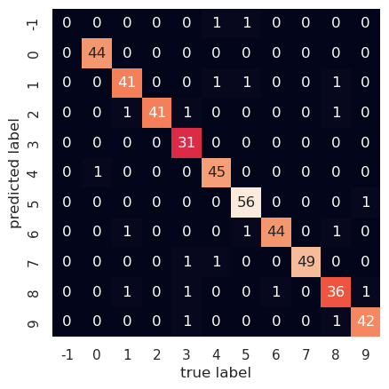

Title: identifying handwritten numbers with a three layer neural net
Date: 2023-02-08
Category: machine learning
Tags: neural net, dropout
Slug: identifying handwritten numbers with a three layer neural net
Authors: Kayla Lewis
Summary: We create a three layer neural net that can identify handwritten numbers and use a regularization technique called dropout to prevent overfitting


In this post, we'll create a three layer neural net for identifying handwritten numbers; to keep it from overfitting, we'll use a technique known as dropout. First, let's have a look at the data.


```python
import matplotlib.pyplot as plt
import seaborn as sns; sns.set()
from sklearn.datasets import load_digits

digits = load_digits()
digits.images.shape
```


    (1797, 8, 8)


We have 1797 handwritten numbers, each represented by 8x8=64 pixels; here's a plot showing some of them:


```python
%matplotlib inline
fig, axes = plt.subplots(10,10,subplot_kw={'xticks':[], 'yticks':[]})
for i, ax in enumerate(axes.flat):
    ax.imshow(digits.images[i],cmap='binary',interpolation='nearest')
    ax.text(0.1,0.2,str(digits.target[i]),color='blue')
```
    

    
For each number, we'll convert its 8x8 matrix of pixel values into an array of length 64; then we'll feed those numbers into layer 0 of our neural net. The next, hidden layer, will contain 200 neurons, and the output layer will contain 10 neurons, the first corresponding to the number 0, the second to 1, and so on up to 9. The output numbers will be "one-hot" encoded so, for example, if the number we feed in is 4 the neural net will ideally output the array [0, 0, 0, 0, 1, 0, 0, 0, 0, 0]. We start by getting our data into the proper form as well as setting up the variables and activation functions that our neural net will need.


```python
import numpy as np
from sklearn.model_selection import train_test_split
from sklearn.metrics import confusion_matrix

# normalize the data, hot-one encode the target data; create 
# training and test sets
X = digits.data
y_pre = digits.target
y = np.zeros((y_pre.shape[0],10))
for i in range(y_pre.shape[0]):
    y[i,y_pre[i]]=1.0
X = (X-X.mean())/X.var()
Xtrain, Xtest, ytrain, ytest = train_test_split(X,y)

# initialize weights and layers for a 3 layer neural net
# for which all biases are set to zero
num_inputs   = 64
num_outputs  = 10
hidden_layer = 200
layer_0 = np.zeros((1,num_inputs))
layer_1 = np.zeros((1,hidden_layer))
layer_2 = np.zeros((1,num_outputs))
weights_01 = 2.0*np.random.random((num_inputs,hidden_layer))-1.0
weights_12 = 2.0*np.random.random((hidden_layer,num_outputs))-1.0

# define the activation functions and their derivatives
# layer_num = 1 will return the function for layer 1 and 
# layer_num = 2 will return that for layer 2
def activ_func(x,layer_num):
    if (layer_num==1):
        return np.tanh(x)
    elif (layer_num==2):
        return np.exp(x)/np.exp(x).sum()

def activ_deriv(x,layer_num):
    if (layer_num==1):
        return 1.0-np.tanh(x)**2.0
    elif (layer_num==2):
        soft_max = np.exp(x)/np.exp(x).sum()
        return soft_max*(1.0-soft_max)
```

Now we let the neural net learn from the data but, to keep it from overlearning (that is, memorizing details that are not relevant for detecting the overall patterns), we randomly set half the neurons of the hidden layer to zero before each backpropagation step and we double the other ones to compensate for the missing half of the signal from that layer.


```python
alpha = 0.1
max_iter = 200
err_tol  = 0.01
err = 1000.0
iter = 0
# toggle dropout on or off
dropout = 1
while ((iter<max_iter) & (err>err_tol)):
    err = 0.0
    for i in range(Xtrain.shape[0]):
        layer_0 = Xtrain[i].reshape(1,num_inputs)
        layer_1 = activ_func(np.matmul(layer_0,weights_01),1)
        if (dropout == 1):
            dropout_mask = \
                    np.random.randint(0,2,layer_1.shape)
            layer_1 *= 2.0*dropout_mask
        layer_2 = activ_func(np.matmul(layer_1,weights_12),2)

        delta = layer_2-ytrain[i]
        deriv_vec2   = activ_deriv(layer_2,2)
        deriv_diag2  = np.diag(deriv_vec2.ravel())
        gradient_12  = \
                np.outer(layer_1,np.matmul(delta,deriv_diag2))
        deriv_vec1   = activ_deriv(layer_1,1)
        deriv_diag1  = np.diag(deriv_vec1.ravel())
        if (dropout==1):
            dropout_diag = np.diag(dropout_mask.ravel())
            deriv_diag1 *= dropout_diag
        omega = np.matmul(weights_12.T,deriv_diag1)
        omega = np.matmul(deriv_diag2,omega)
        delta_omega = np.matmul(delta,omega)
        gradient_01 = np.outer(layer_0,delta_omega)

        weights_12 -= alpha*gradient_12
        weights_01 -= alpha*gradient_01

        err += np.sum(delta**2.0)
    err /= X.shape[0]
    iter += 1

if (iter<max_iter):
    print("converged at iteration: ",iter-1)
    print("average error: ",err)
else:
    print("failed to converge")
```

    converged at iteration:  11
    average error:  0.009976326528757164


Now we see how well our model can predict numbers for the test set.


```python
err = 0.0
num_correct = 0
ypred = np.zeros((Xtest.shape[0],10))
for i in range(Xtest.shape[0]):
    layer_0 = Xtest[i].reshape(1,num_inputs)
    layer_1 = activ_func(np.matmul(layer_0,weights_01),1)
    layer_2 = activ_func(np.matmul(layer_1,weights_12),2)
    ypred[i] = layer_2.round()
    delta = layer_2-ytest[i]
    err += np.sum(delta**2.0)
    if (layer_2.round()==ytest[i]).all():
        num_correct += 1
err /= Xtest.shape[0]
print("average test set error:",err)
frac_correct = num_correct/Xtest.shape[0]
print("percent correct:",frac_correct*100.0)
```

    average test set error: 0.06930050980970036
    percent correct: 95.33333333333334


Our neural net predicts about 95% of the test set numbers correctly. Let's plot the confusion matrix for our current predictions, and set to -1 any output for which the model fails to select a number.


```python
pred_array = np.zeros((1,Xtest.shape[0])).ravel()
test_array = np.zeros((1,Xtest.shape[0])).ravel()
for i in range(Xtest.shape[0]):
    if (ypred[i]==1.0).any():
        pred_array[i] = np.where(ypred[i]==1)[0][0]
    else:
        pred_array[i] = -1
    test_array[i] = np.where(ytest[i]==1)[0][0]

mat = confusion_matrix(test_array,pred_array)
labels = np.linspace(-1,9,11).astype('int64')
sns.heatmap(mat.T, square=True,annot=True, \
            xticklabels=labels, \
            yticklabels=labels, cbar=False)
plt.xlabel('true label')
plt.ylabel('predicted label')
```


    Text(109.44999999999997, 0.5, 'predicted label')

    

    


We can see, e.g., that one time the correct answer was 4, while the model was unable to select any number. On the other hand, it correctly identified 3 as such 31 times. The derivations for the backpropagation equations are instructive but a bit involved, so I'll provide those in the next post.


[Discuss on Twitter](https://twitter.com/Estimatrix/status/1555693184977600512?s=20&t=YFPoxpEQ2Qp14U4FliD7fA)