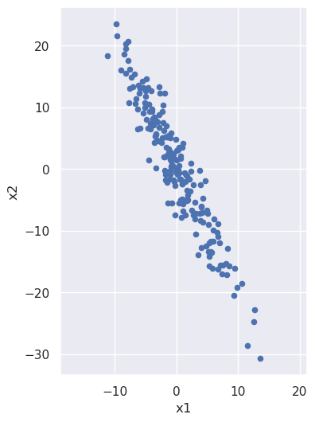
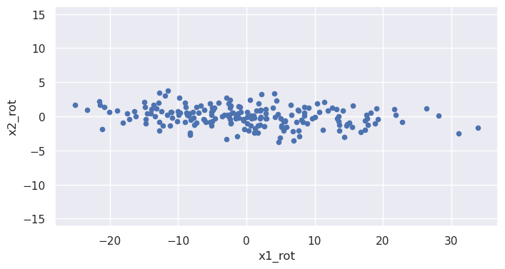
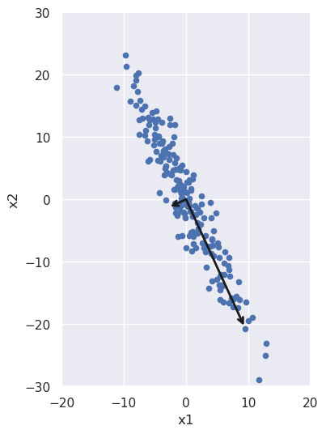

Title: gaining intuition about what principal component analysis does
Date: 2022-12-22
Category: machine learning
Tags: principal component analysis
Slug: gaining intuition about what principal component analysis does
Authors: Kayla Lewis
Summary: by rotating a noisy line we can better understand the meaning of principal component decomposition


Let's build some intuition about what is happening during principal component analysis, for which purpose it will be useful to start with a noisy line:


```python
import numpy as np
import pandas as pd
import matplotlib.pyplot as plt
import seaborn as sns; sns.set()
from sklearn.decomposition import PCA

x1 = 5.0*np.random.randn(200)
x2 = -2.0*x1 + 3.0*np.random.randn(200)

data = {'x1':x1, 'x2':x2}
X = pd.DataFrame(data,columns=['x1','x2'])

%matplotlib inline
plt.figure(figsize=(4,6))
plt.scatter(X['x1'],X['x2'],s=20)
plt.xlabel('x1')
plt.ylabel('x2')
plt.axis('equal')
```


    (-12.482481434446724,
     14.814535592515966,
     -33.44719467164779,
     26.176911201331897)


    

    


We note that x2 is (negatively) correlated with x1: as the x1 coordinate goes up, the x2 tends to go down. But what if we looked at the same noisy line but from the perspective of a coordinate system that has been rotated? From such a rotated system the line would have a different slope, and we can imagine choosing just the right angle of rotation to make that slope be zero:  


```python
phi = -np.arctan(2.0)
rot_mat = np.array([[np.cos(phi),np.sin(phi)],[-np.sin(phi),np.cos(phi)]])
X_rot = np.matmul(rot_mat,X.T).T

plt.figure(figsize=(8,4))
plt.scatter(X_rot[0],X_rot[1],s=20)
plt.xlabel('x1_rot')
plt.ylabel('x2_rot')
plt.axis('equal')
```


    (-28.000799803397552, 36.84935041589216, -4.194134729428883, 4.177030419730786)


    

    


Values of the rotated coordinate x1_rot and x2_rot are (approximately) uncorrelated: x2_rot doesn't tend to do anything particular as x1_rot increases. 

One way of gauging how much one column, $c$, of data is correlated with another, $d$, is via the covariance matrix, defined as
$$
\begin{matrix}
    \sum_i\frac{(c_i-\mu_c)^2}{n} & \sum_{ij}\frac{(c_i-\mu_c)(d_j-\mu_d)}{n} \newline
    \sum_{ij}\frac{(c_i-\mu_c)(d_j-\mu_d)}{n} & \sum_i\frac{(d_i-\mu_d)^2}{n}
\end{matrix}
$$
where $c_i$ is the $i$th value in column $c$, $d_i$ is the $i$th value in column $d$, and $\mu$ is the column average. (If we're interested in estimating population values as opposed to just calculating them for the sample at hand, we need to put $n-1$ instead of $n$ in the denominators, but that's tangent to our discussion here.)

We can calculate the covariance matrix for the old and rotated variables:


```python
x1_mean = X['x1'].mean()
x2_mean = X['x2'].mean()
X_centered = X
X_centered['x1'] = X_centered['x1']-x1_mean
X_centered['x2'] = X_centered['x2']-x2_mean
cov = np.dot(X_centered.T,X_centered)/X_centered.shape[0]
print(cov)
```

    [[ 22.99590999 -45.96157494]
     [-45.96157494 101.98732514]]


```python
x1_rot_mean = X_rot[0].mean()
x2_rot_mean = X_rot[1].mean()
X_rot_centered = X_rot
X_rot_centered[0] = X_rot_centered[0]-x1_rot_mean
X_rot_centered[1] = X_rot_centered[1]-x2_rot_mean
cov_rot = np.dot(X_rot_centered.T,X_rot_centered)/X_rot_centered.shape[0]
print(cov_rot)
```

    [[122.95830206  -4.0196211 ]
     [ -4.0196211    2.02493307]]


The off-diagonal terms are much smaller and would indeed be zero except for the fact that I only approximated the correct rotation angle for the noisy data above; also there will be some residual numerical error. Principal value decomposition determines this rotation angle accurately. After running the analysis, pca.components_ contains two unit vectors, one pointing along the direction of increasing x1_rot and the other along the direction of increasing x2_rot. Let's use this fact to obtain the rotation angle and check that the off-diagonal components of the covariance matrix are indeed zero to within numerical limits:


```python
pca = PCA()
pca.fit(X)
phi = np.arctan(pca.components_[0][1]/pca.components_[0][0])
rot_mat = np.array([[np.cos(phi),np.sin(phi)],[-np.sin(phi),np.cos(phi)]])
X_rot = np.matmul(rot_mat,X.T).T
x1_rot_mean = X_rot[0].mean()
x2_rot_mean = X_rot[1].mean()
X_rot_centered = X_rot
X_rot_centered[0] = X_rot_centered[0]-x1_rot_mean
X_rot_centered[1] = X_rot_centered[1]-x2_rot_mean
cov_rot = np.dot(X_rot_centered.T,X_rot_centered)/X_rot_centered.shape[0]
print(cov_rot)
```

    [[1.23091760e+02 3.82417865e-14]
     [3.82417865e-14 1.89147493e+00]]


We can also plot these vectors, re-scaled for visibility and also to indicate the spread in the data along each direction:


```python
def draw_vector(v0,v1,ax=None):
    ax = ax or plt.gca()
    arrowprops=dict(arrowstyle='->',
                    linewidth=2,
                    shrinkA=0, shrinkB=0, color='k')
    ax.annotate('',v1,v0,arrowprops=arrowprops)

X_centered = X - X.mean()
plt.figure(figsize=(5,6))
plt.scatter(X_centered['x1'],X_centered['x2'],s=20)
plt.xlabel('x1')
plt.ylabel('x2')
plt.axis([-20, 20, -30, 30])
plt.gca().set_aspect('equal', adjustable='box')
vec0 = 2.0*np.sqrt(pca.explained_variance_[0])* \
       pca.components_[0]
vec1 = 2.0*np.sqrt(pca.explained_variance_[1])* \
       pca.components_[1]
origin = np.array([0,0])
draw_vector(origin,vec0)
draw_vector(origin,vec1)
```


    

    


The spread along each direction is encapsulated in the variance of the data in each principal component direction. If we take the square root of it and multiply by two, we get all the data that lies within two standard deviations of the mean; that's what we used to scale the vectors in the above figure. We can check that those variances are the same as the diagonal terms in our rotated covariance matrix from above:


```python
eigenval0 = pca.explained_variance_[0]
eigenval1 = pca.explained_variance_[1]
print(eigenval0,eigenval1)
```

    123.7103117628416 1.9009798260289357


In the present context, these numbers are also known as eigenvalues: If we multiply the eigenvectors by the covariance matrix, we'll get those vectors back again, times these values. We can see this by acting on the eigenvectors and then projecting the results back onto the original unit eigenvectors using the dot product:


```python
eigenvec0 = pca.components_[0]
eigenvec1 = pca.components_[1]
cov = np.dot(X_centered.T,X_centered)/X_centered.shape[0]
eigenval0 = np.dot(np.matmul(cov,eigenvec0).T,eigenvec0)
eigenval1 = np.dot(np.matmul(cov,eigenvec1).T,eigenvec1)
print(eigenval0,eigenval1)
```

    123.09176020402727 1.8914749268987887


