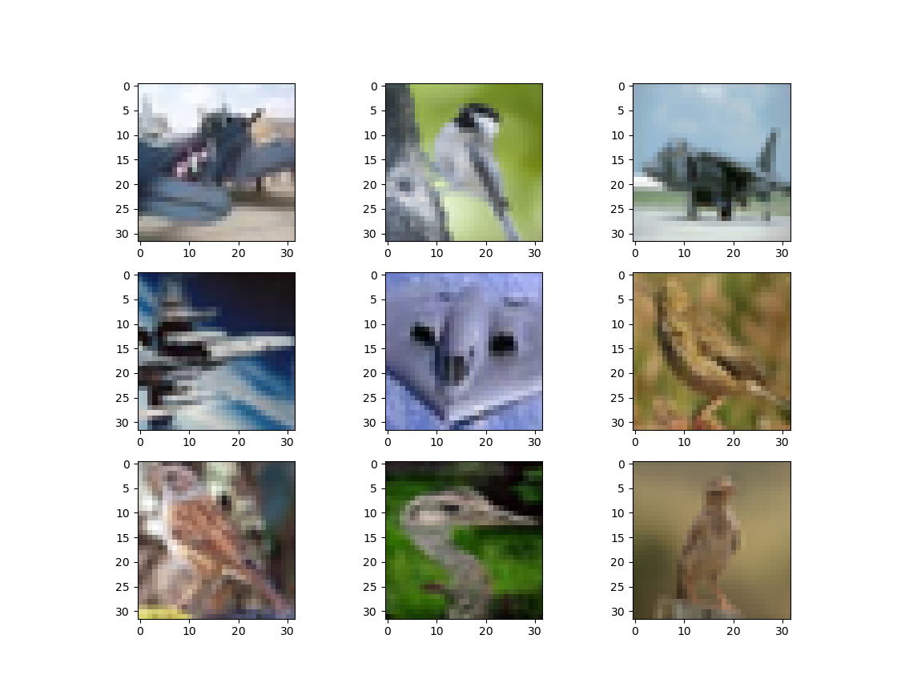

Title: distinguishing birds from airplanes with a pytorch convnet
Date: 2023-04-15
Category: machine learning
Tags: convolutional networks
Slug: distinguishing birds from airplanes with a pytorch
Authors: Kayla Lewis
Summary: we set up a net with convolutional architecture in pytorch, which can distinguish images of birds from those of airplanes


This post, in which we'll create a convolutional net to discern birds from airplanes, is inspired by a couple of chapters from the book Deep Learning with PyTorch, by Stevens, Antiga, and Viehmann. Here are some of the images that we'll be dealing with:



First let's load up the data and normalize it.


```python
from torchvision import datasets, transforms
from torch import optim
import torch
import sys
cifar = datasets.CIFAR10('.',train=True,download=True, \
                         transform=transforms.ToTensor())
cifar_val = datasets.CIFAR10('.',train=False,download=True, \
                             transform=transforms.ToTensor())

# normalize the data
imgs     = torch.stack([img_t for img_t, _ in cifar],dim=3)
imgs_val = torch.stack([img_t for img_t, _ in cifar_val],dim=3)
mean     = imgs.view(3,-1).mean(dim=1)
mean_val = imgs_val.view(3,-1).mean(dim=1)
std      = imgs.view(3,-1).std(dim=1)
std_val  = imgs_val.view(3,-1).std(dim=1)
cifar    = datasets.CIFAR10('.',train=True,download=False, \
                            transform=transforms.Compose([ \
                            transforms.ToTensor(), \
                            transforms.Normalize(mean,std)]))
cifar_val = datasets.CIFAR10('.',train=False,download=False, \
                             transform=transforms.Compose([ \
                             transforms.ToTensor(), \
                             transforms.Normalize(mean_val, \
                             std_val)]))
```

    Downloading https://www.cs.toronto.edu/~kriz/cifar-10-python.tar.gz to ./cifar-10-python.tar.gz


    100%|██████████| 170498071/170498071 [00:11<00:00, 14695382.58it/s]


    Extracting ./cifar-10-python.tar.gz to .
    Files already downloaded and verified


This dataset contains images of lots of other things besides birds and planes, so we'll need to filter out the images we're interested in.


```python
# filter the images for birds and airplanes
label_map = {0:0,2:1}
class_names = ['airplane','bird']
cifar = [(img,label_map[label]) \
        for img,label in cifar  \
        if label in [0,2]]
cifar_val = [(img,label_map[label]) \
        for img,label in cifar_val \
        if label in [0,2]]
```

Next we'll define our neural net architecture.


```python
import torch.nn as nn

class Net(nn.Module):
    def __init__(self):
        super().__init__()
        # convert 3 RGB channels into 16 channels
        # we're starting with 32x32 pixels
        self.conv1 = nn.Conv2d(3,16,kernel_size=3,padding=1)
        self.act1  = nn.Tanh()
        # pool and reduce images to 16x16 pixels
        self.pool1 = nn.MaxPool2d(2)
        # convert 16 channels into 8 channels
        self.conv2 = nn.Conv2d(16,8,kernel_size=3,padding=1)
        self.act2  = nn.Tanh()
        # pool and reduce the images to 8x8 pixels
        # we now have 8 channels of 8x8 images
        self.pool2 = nn.MaxPool2d(2)
        # fully connected layers follow
        self.fc1   = nn.Linear(8*8*8,32)
        self.act3  = nn.Tanh()
        self.fc2   = nn.Linear(32,2)
        self.act4  = nn.LogSoftmax(dim=1)

    def forward(self,x):
        out = self.pool1(self.act1(self.conv1(x)))
        out = self.pool2(self.act2(self.conv2(out)))
        out = out.view(-1,8*8*8)
        out = self.act3(self.fc1(out))
        out = self.act4(self.fc2(out))
        return out
```

It's time to train the model; we'll do it in randomized batches.


```python
num_out = 2
num_input  = 512
num_hidden = 512
train_loader = torch.utils.data.DataLoader(cifar,batch_size=64, \
                                           shuffle=True)
model = Net()
loss_func = nn.NLLLoss()
learning_rate = 0.01
optimizer  = optim.SGD(model.parameters(),learning_rate)
err_tol    = 0.1
max_epoch  = 200
epoch      = 0
err = 1.e5
while ((epoch<max_epoch)&(err>err_tol)):
    err = 0.0
    for imgs, labels in train_loader:
        batch_size = imgs.shape[0]
        outputs = model(imgs)
        loss = loss_func(outputs,labels)

        optimizer.zero_grad()
        loss.backward()
        optimizer.step()
        err += loss.item()

    err /= len(train_loader)
    epoch += 1
    if (epoch%10==0):
        print("epoch: %d, loss: %f" % (epoch, err))
```

    epoch: 10, loss: 0.348339
    epoch: 20, loss: 0.301792
    epoch: 30, loss: 0.271439
    epoch: 40, loss: 0.247062
    epoch: 50, loss: 0.227016
    epoch: 60, loss: 0.210078
    epoch: 70, loss: 0.192694
    epoch: 80, loss: 0.175032
    epoch: 90, loss: 0.160963
    epoch: 100, loss: 0.146820
    epoch: 110, loss: 0.134589
    epoch: 120, loss: 0.125042
    epoch: 130, loss: 0.113120
    epoch: 140, loss: 0.102200


As usual, we'd like to know how well our model performs out of sample.


```python
# check out-of-sample accuracy
num_correct = 0
for img, label in cifar_val:
    label_true = torch.tensor(label)
    out = model(img)
    label_pred = torch.exp(out).argmax()

    if (label_true==label_pred):
        num_correct += 1

percent = (num_correct/len(cifar_val))*100.0
print("percent correct OOS: ",percent)
```

    percent correct OOS:  89.5


Given the low image quality and the size of the neural net, 90% doesn't seem too bad!

[Discuss on Twitter](https://twitter.com/Estimatrix/status/1555693184977600512?s=20&t=YFPoxpEQ2Qp14U4FliD7fA)