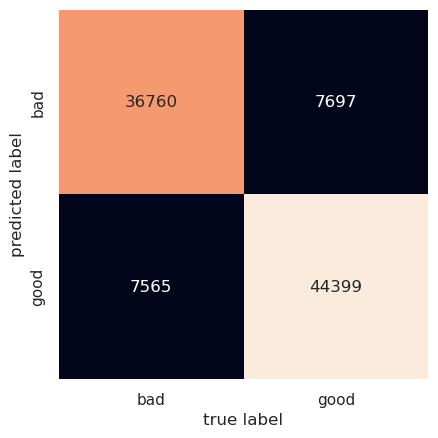

Title: sentiment analysis using naive Bayes
Date: 2022-12-9
Category: machine learning
Tags: naive Bayes
Slug: sentiment analysis using naive Bayes
Authors: Kayla Lewis
Summary: we can use a simple baseline model for predicting review sentiment that does surprisingly well


Suppose we want to predict whether the sentiment of an unlabeled customer review is positive or negative, based on some reviews that have already been labeled as positive or negative. One computationally fast way of doing this is to use naive Bayes classification. From Bayes' theorem the probability that a review is positive (+) based on a review (R) is
$$
   P(+|R) = \frac{P(R|+)P(+)}{P(R)}
$$
and the probability that the review is negative (-) is given by
$$
   P(-|P) = \frac{P(R|-)P(-)}{P(R)}.
$$
One way of avoiding having to calculate $P(R)$ is to consider the ratio 
$$
   \frac{P(+|R)}{P(-|R)}=\frac{P(R|+)P(+)}{P(R|-)P(-)}.
$$
If we make the reasonable assumption that $P(-)=P(+)$ prior to having any evidence one way or the other, we have
$$
   \frac{P(+|R)}{P(-|R)}=\frac{P(R|+)}{P(R|-)},
$$
and the problem has been reduced to deciding which label, positive or negative, makes the data (i.e., the reviews) more likely. 

One simple yet useful way to encode a review in a way that we can probabilistically model it is to think of it as a "bag of words" where each word either appears in a given review or doesn't; generating a review then amounts to drawing words at random from the bag of words; such a process is captured well by a multinomial distribution: We assume that there are two multinomial distributions, one that gives rise to positive reviews and another that gives rise to negative ones; these reviews will have different parameters. The naive part of naive Bayes comes in making simplistic assumptions about these parameters. The strength of the approach is that it's fast and that it often works well if the data for each label are well-separated in feature space, which they tend to be if the dimensionality of the space is large. (And it is for the bag of words review representation.)

Below, we analyze a large number of labeled amazon reviews and then see if we can predict correctly the labels for a testing set. We clean the data, fit a naive multinomial Bayes model to it, and then have a look at the accuracy score and confusion matrix for the test data. (We've run the analysis before, so some of the necessary files already exist; hence the messages.) The code below can be accessed over at my [github](https://github.com/estimatrixPipiatrix/decision-scientist.git) repository.


```python
run clean_data.py
```

    train.ft.txt.bz2 already exists


    bunzip2: Output file train.ft.txt already exists.
    bunzip2: Output file test.ft.txt already exists.


```python
run nb_amazon.py
```

    /home/kayla/anaconda3/lib/python3.9/site-packages/sklearn/utils/validation.py:993: DataConversionWarning: A column-vector y was passed when a 1d array was expected. Please change the shape of y to (n_samples, ), for example using ravel().
      y = column_or_1d(y, warn=True)

```python
run check_results.py
```

    accuracy score:  0.8417149791020628
    

    


We see that with a simple model we are able to predict the out-of-sample data with 84% accuracy; the confusion matrix tells us that the model confuses good (positive) and bad (negative) reviews with one another with about equal frequency. We can use the performance of naive Bayes classifiers as a baseline against which to compare more sophisticated models if we desire higher accuracy.
