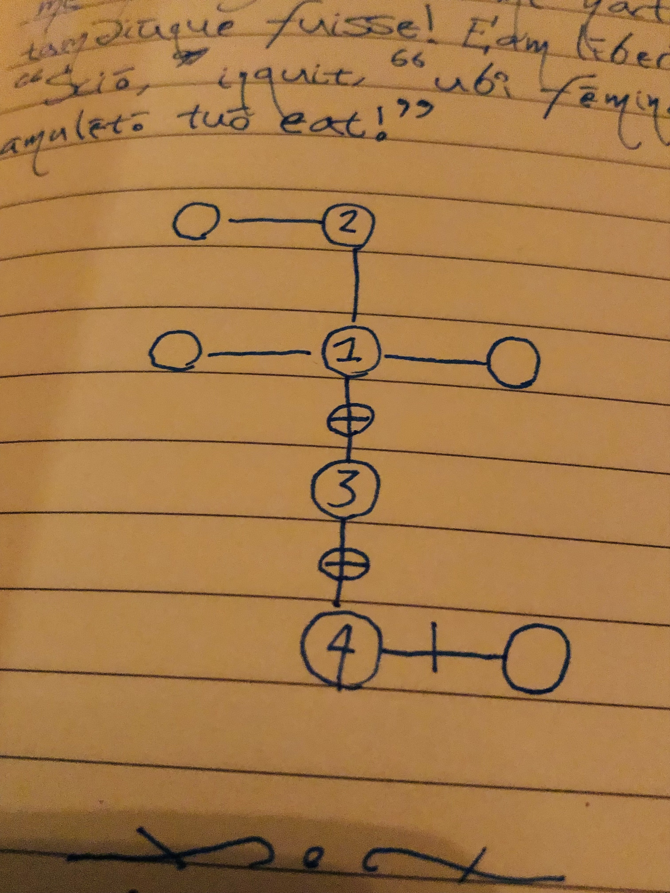

Title: a game for getting stuff done and learning a foreign language
Date: 2023-02-25
Category: productivity
Tags: rpg, foreign language, writing
Slug: a game for getting stuff done and learning a foreign language
Authors: Kayla Lewis
Summary: we present a to-do list game that combines foreign language learning, writing, and role playing

Like writing? Like learning foreign languages? Like role playing games? Here is a to-do list game I made up that has all three:

(a) Use your imagination to transform the task you need to do into a fantasy realm scenario. For example, "Gather ingredients to bake a cake" could become "Obtain reagents for a powerful strength spell." Write this sentence down in the target language (I tend to use Latin for mine). Now circle a word from the sentence that seems especially central to its meaning, for example the word "spell" (which could be translated as "incantāmentum" in Latin).

(b) The letters in the word determine certain features of your surroundings (the following identifications are based on letter frequencies in Latin; feel free to change them to suit your target language):

“a”: there is a door (or some open path) toward the east from your current position

“s”: door to the north

“t”: door to the west

“u”: door to the south

If any of these letters shows up more than once in the word, then the door is locked (or the pathway blocked). For example, using "incantāmentum" we find that there are doors to the east, west, and south; the doors to the west and the east are locked, but the south one is open. To go in a currently inaccessible direction, in this case to the west or east, you will need the word to have the letter... 

“c”: there is a key somewhere near you (or some means of unblocking an inaccessible direction)

Each key can be used exactly once, after which it disappears! For our example "incantāmentum" we indeed find a key that was, say, hidden under a rug lying in the center of the room.

(c) Okay, so now you know some basic facts about your surroundings. It's time to do part of the real-world task (with whatever degree of chunkiness you deem appropriate). After this task is completed...

(d) ...you can choose to stay in your current area or not. Either way, move to the next part of your current task or the next task on your to-do list, and write another sentence to advance your story line based on that item. For example, if you've collected the ingredients for the cake, the next step might be to mix the butter, oil, and sugar. In the game this might translate to finding three of the reagents you need - tongue of newt, eye of salamander, mandrake root - in your current location. 

If you chose to go through a door, then circle a key word in your new sentence; the word’s letters will determine the open and blocked directions in your new surroundings.

(e) As you progress, keep a little drawing showing where you’ve been as well as locked and unlocked paths, as shown below: You may need to revisit places to move your story forward!

And that's the basic system – happy adventuring :)

**further suggestions**

* Use props and action figures to show what's happening in your surroundings.
* As a simple battle system, when you encounter a monster you'll need to roll higher than some predetermined number to win, which depends on the strength of the foe you face; if you roll lower than that you suffer some penalty, e.g., being moved back several rooms. Potions, magical items, spells, and abilities modify the number you need to roll to win.
* As you complete tasks, give yourself experience points that allow you to unlock new abilities when you reach a specified number of points.
* If you have to solve some tough real world problem, translate it into solving an in-game riddle to open, e.g., a door or a teleportation portal, or to cast a complicated spell.
* Give your realm a name and some lore to add depth. (For example, my realm is called the Imperium Arcānum, or the The Arcane Imperium.)
* Create mini-quests within the main adventure. 

This game definitely works best when you use your imagination both to play and to add variety to it; now that you have the basic idea, modify it in whatever ways that make it the most fun for you! 

[Discuss on Twitter](https://twitter.com/Estimatrix/status/1555693184977600512?s=20&t=YFPoxpEQ2Qp14U4FliD7fA)