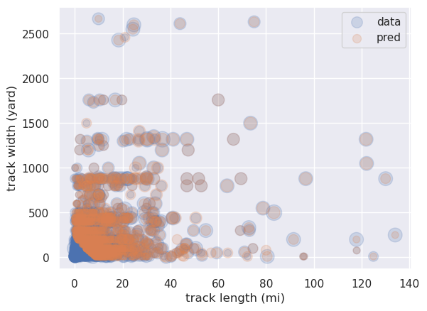

Title: using lasso regression to study tornado magnitudes
Date: 2022-12-16
Category: machine learning
Tags: lass regression
Slug: using lasso regression to study tornado magnitudes
Authors: Kayla Lewis
Summary: we use lasso regression with cross validation to look at how tornado magnitude depends on the length and width of its track


For this example we look at a set of tornado data from 1950 to 2015, which includes information such as the starting latitude and longitude of spawned tornadoes, injuries, fatalities, property loss, width of the tornado track, length of the track, and magnitude. It seems reasonable to suspect that the magnitude of a tornado would scale with the length and width of the track; in this post we'll use linear regression to investigate this possiblity.

We start by importing all the necessary libraries and loading the data:

```python
import subprocess
import numpy as np
import pandas as pd
from sklearn.linear_model import LinearRegression
from sklearn.linear_model import LassoCV
from sklearn.preprocessing import PolynomialFeatures
from sklearn.preprocessing import StandardScaler
from sklearn.model_selection import train_test_split
from sklearn.metrics import r2_score
from sklearn.utils import resample
import matplotlib.pyplot as plt
import seaborn as sns; sns.set()

subprocess.Popen("./extract_data.sh",shell=True)
data = pd.read_csv('Tornadoes_SPC_1950to2015.csv')
```

    Tornadoes_SPC_1950to2015.csv already exists


Next we define the label we want to predict, tornado magnitude, and the features we want to use to predict it, track length and width:


```python
y = data['mag']
X_pre = pd.DataFrame(columns=['len', 'wid'])
X_pre['len'] = data.fillna(method='pad')['len']
X_pre['wid'] = data.fillna(method='pad')['wid']
```

Perhaps we'd like to allow for the possibility that the magnitude depends on products of these quantities; for that we create extra polynomial feature columns up to degree three:


```python
poly = PolynomialFeatures(3,include_bias=False)
X = poly.fit_transform(X_pre)
scaler = StandardScaler().fit(X)
X = scaler.transform(X)
X = pd.DataFrame(X)
X.columns = poly.get_feature_names_out()
```

Now we split the data into training and test sets:


```python
X_train,X_test,y_train,y_test = train_test_split(X,y,\
                                train_size=0.9)
```

We'll use plain old linear regression first:


```python
model = LinearRegression()
model.fit(X_train,y_train)
y_pred = model.predict(X_test)
```

After fitting the model parameters, we can extract them and also use bootstrap sampling to get an idea of the uncertainties:


```python
params = pd.Series(model.coef_, \
                   index=poly.get_feature_names_out())
err = np.std([model.fit(*resample(X_train,y_train)).coef_
             for i in range(100)],0)
print(pd.DataFrame({'effect': params,
                    'error': err}))
```

                 effect     error
    len        0.643602  0.017353
    wid        0.602164  0.016956
    len^2     -0.638605  0.060118
    len wid   -0.137344  0.031313
    wid^2     -0.570082  0.045939
    len^3      0.284680  0.060439
    len^2 wid  0.090327  0.024600
    len wid^2  0.060095  0.030015
    wid^3      0.241748  0.045091


Let's also print the $r^2$ score:

```python
print('r2_score: ',r2_score(y_test,y_pred))
```

    r2_score:  0.34429559935620946


We see that the current model explains about 34% of the variability in the data.

Finally let's compare the data with predicted values using a scatter plot, where the size of the circles represents the magnitude:


```python
X = scaler.inverse_transform(X)
X = pd.DataFrame(X,columns=poly.get_feature_names_out())
X_train = scaler.inverse_transform(X_train)
X_train = pd.DataFrame(X_train, \
                       columns=poly.get_feature_names_out())
X_test = scaler.inverse_transform(X_test)
X_test = pd.DataFrame(X_test, \
                      columns=poly.get_feature_names_out())

y_pred = y_pred.astype('int')

plt.scatter(X_test['len'],X_test['wid'],s=50*y_test,alpha=0.2, \
            label='data')
plt.scatter(X_test['len'],X_test['wid'],s=50*y_pred,alpha=0.2, \
            label='pred')
plt.xlabel('track length (mi)')
plt.ylabel('track width (yard)')
plt.legend(loc='upper right')
plt.show()
```

    

    

If we repeat the above procedure but using Lasso regression with cross-validation to select the best model, we obtain very similar results (for example there's no reduction in the number of coefficients), and again with $r^2\approx 0.34$. So, as happens sometimes, we aren't seeing any improvement using the more sophisticated method.

