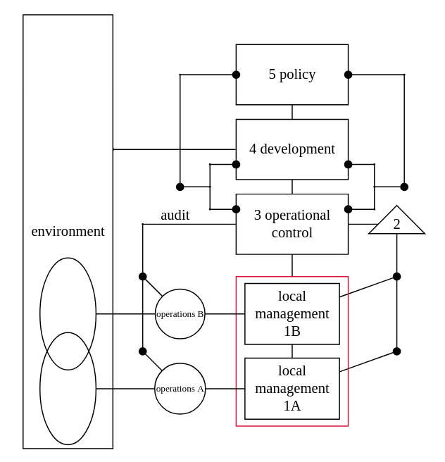

Title: the viable system model
Date: 2022-08-22
Category: systems thinking
Tags: vsm
Slug: the viable system model
Authors: Kayla Lewis
Summary: the viable system model has much to offer in situations of organizational complexity

Following the [organismal perspective](https://www.thedecisionblog.com/seven%20paradigms%20of%20systems%20thinking.html), think for a moment about what kinds of modules you would need, from a neurological perspective, in order to create a living, purposeful, organism that could survive in a turbulent environment[^1].

(1) There would need to be a set of interfaces through which the organism could sense and interact with its environment on a basic level.

(2) These interfaces would need to be coordinated with one another.

(3) The organism would need some way of sensing (not necessarily consciously) whether those interfaces were working properly and making the necessary changes if not.

(4) There would need to be a way for the organism to learn what's going on in its environment and consider more global changes it might make to its behavior in order to perform better, a kind of R&D center.

(5) For the organisms to be purposeful, it would need a kind of executive control center that factors in what's going on in the other systems to some extent and gives meaning to the organism's experience.

If we continued this way and thought very hard about how modules 1-5 above would need to be wired to each other, we very well might end up with Stafford Beer's Viable System Model.

The amazing thing about that model is that it provides a blueprint for how any system might best be designed to be able to thrive in a changing and largely unpredictable environment.

"System" here can be taken very broadly, for example: "the system of a corporation" (an example of which is shown below, with all the appropriate "wiring"); "the system of me, my social media accounts, and my blog"; "a non-profit organization", etc.

By looking at systems as if they were organisms and asking how modules 1-5 are instantiated in each particular instance, whether they are present in the real-world system, and whether they are wired together correctly, we can very often find ways of increasing their viability.

[^1]: A jellyfish doesn't seem purposeful in the full sense intended here (e.g., it doesn't attach meaning to its experience), but it embodies the other ideas well and it's pretty :)

[Discuss on Twitter](https://twitter.com/Estimatrix/status/1555693184977600512?s=20&t=YFPoxpEQ2Qp14U4FliD7fA)

