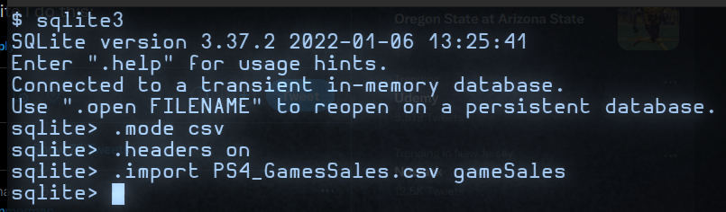
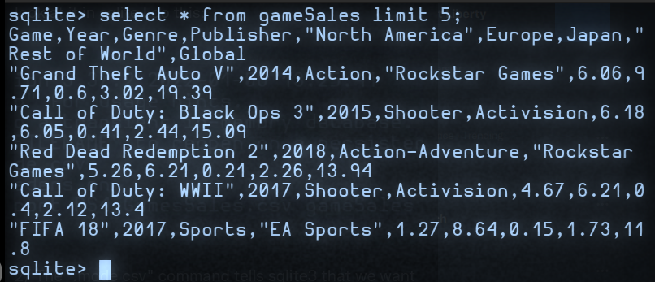
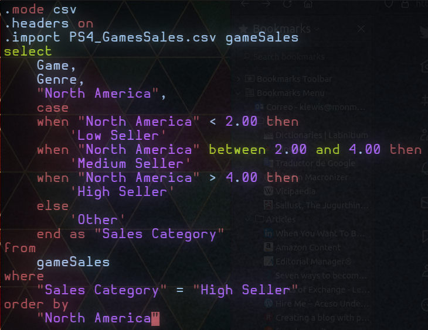
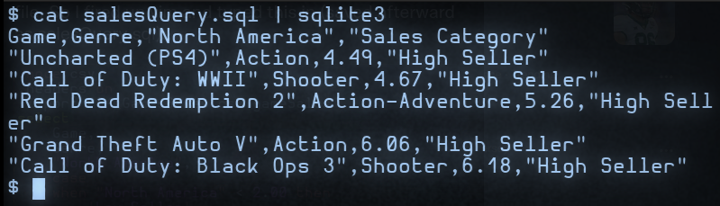

Title: interrogating video game data with SQL
Date: 2022-11-19
Category: SQL
Tags: SQL
Slug: interrogating video game data with SQR
Authors: Kayla Lewis
Summary: using SQL to find where and which products are selling the best

Okay so we've got a csv file about PS4 game sales; to look at it in sqlite we can do this:

The ".mode csv" command tells SQL that we want to read a csv file; ".headers on" says that, when the table info is displayed, we want to see the column labels; the last command imports the file as a table called gameSales.Then to get a first look at the data we can do this:

The "select *" part tells SQL to extract data from all of the columns, but the "limit 5" part tells SQL to show only the first 5 rows. We can see that there's data on the game title, year, genre, and publisher as well as how much was sold in different parts of the world.

If we only wanted to see, e.g., the Game, Genre, and "North America" columns, we would have typed "select Game, Genre, "North America" from gameSales", etc. Now suppose we want to see which games sold best in North America.
 
For that we can ask SQL to output a new column called "Sales Category", which will say "Low Seller" if less than 2 (of whatever units are being used) were sold "Medium Seller" if between 2 and 4 were sold, and "High Seller" if more than 4 were sold.

That's going to require a case command and is complicated enough to write an SQL script in a separate file. So we can fire up vim (or emacs) and type this in (saved afterward as salesQuery.sql):

The "where" clause near the bottom says to only display rows containing high seller data, and the "order by" clause says to order the output from lowest to highest sales.

To run this script in SQL, we can do a "cat" from the bash shell and pipe the output into sqlite3 like so:

We can see from the output that games from the categories of Action, Action-Adventure, and Shooters sold the best. So if we want to know what kinds of games we could count on most to bring reliable cash flow, this simple analysis suggests that it would be these, at least in North America.

